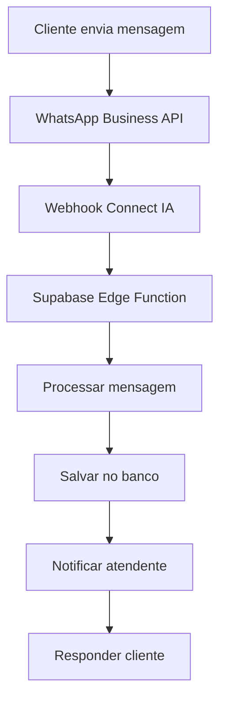
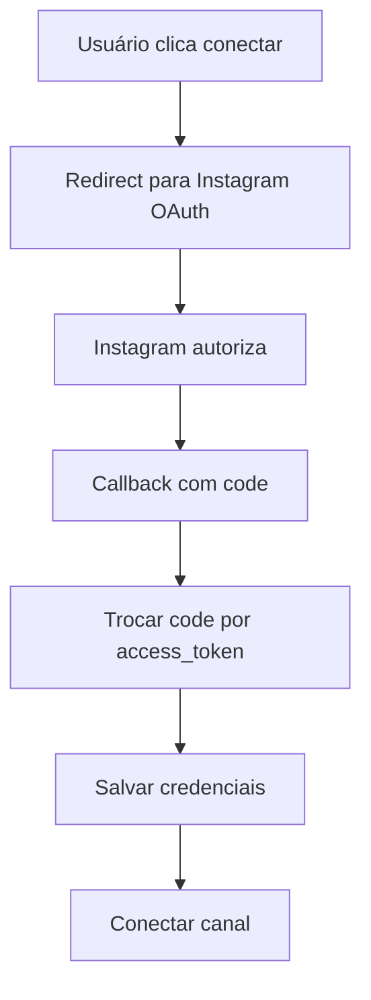

# 🔗 **INTEGRAÇÃO META COMPLETA 2024**
## **Guia Definitivo para WhatsApp Business API e Instagram Basic Display**

---

## 📋 **ÍNDICE**

1. [Configuração Inicial do App Meta](#configuração-inicial-do-app-meta)
2. [WhatsApp Business API](#whatsapp-business-api)
3. [Instagram Basic Display API](#instagram-basic-display-api)
4. [Configuração de Webhooks](#configuração-de-webhooks)
5. [Configuração do Projeto](#configuração-do-projeto)
6. [Variáveis de Ambiente](#variáveis-de-ambiente)
7. [Testes e Validação](#testes-e-validação)
8. [Publicação do App](#publicação-do-app)
9. [Troubleshooting](#troubleshooting)

---

## 🚀 **CONFIGURAÇÃO INICIAL DO APP META**

### **1. Criar App no Meta for Developers**

1. **Acesse**: https://developers.facebook.com/
2. **Login** com conta Facebook Business
3. **Criar App** → **Business** → **Continuar**
4. **Preencher**:
   - **Nome do App**: `Connect IA`
   - **Email de contato**: `contato@agenciapixel.digital`
   - **Categoria**: `Business`
   - **Propósito**: `Gerenciar clientes`

### **2. Configurações Básicas**

```
App ID: 670209849105494
App Secret: [CONFIGURAR NO AMBIENTE]
```

### **3. Domínios Configurados**

```
Domínio do App: connectia.agenciapixel.digital
Domínio do Site: https://connectia.agenciapixel.digital
Privacy Policy: https://connectia.agenciapixel.digital/terms.html
```

---

## 📱 **WHATSAPP BUSINESS API**

### **1. Configuração do WhatsApp Business**

#### **A. Adicionar Produto WhatsApp**
1. **App Dashboard** → **Produtos** → **WhatsApp** → **Configurar**
2. **Número de Telefone**: Configurar número de teste ou produção
3. **Webhook**: Configurar URL e token

#### **B. Configurações Necessárias**

```javascript
// Configurações WhatsApp Business API
const whatsappConfig = {
  phoneNumberId: "PHONE_NUMBER_ID", // ID do número de telefone
  businessAccountId: "BUSINESS_ACCOUNT_ID", // ID da conta business
  accessToken: "ACCESS_TOKEN", // Token de acesso permanente
  verifyToken: "VERIFY_TOKEN", // Token para verificação webhook
  webhookUrl: "https://connectia.agenciapixel.digital/api/whatsapp-webhook"
};
```

### **2. Estrutura do Webhook WhatsApp**

```typescript
// supabase/functions/whatsapp-webhook/index.ts
interface WhatsAppWebhookData {
  object: string;
  entry: Array<{
    id: string;
    changes: Array<{
      value: {
        messaging_product: string;
        metadata: {
          display_phone_number: string;
          phone_number_id: string;
        };
        messages: Array<{
          id: string;
          from: string;
          timestamp: string;
          text?: {
            body: string;
          };
          type: string;
        }>;
      };
      field: string;
    }>;
  }>;
}
```

### **3. Fluxo de Mensagens WhatsApp**



---

## 📸 **INSTAGRAM BASIC DISPLAY API**

### **1. Configuração do Instagram**

#### **A. Adicionar Produto Instagram**
1. **App Dashboard** → **Produtos** → **Instagram Basic Display** → **Configurar**
2. **OAuth Redirect URIs**: `https://connectia.agenciapixel.digital/auth/instagram/callback`
3. **Deauthorize Callback URL**: `https://connectia.agenciapixel.digital/auth/instagram/deauthorize`

#### **B. Configurações OAuth**

```javascript
// Configurações Instagram OAuth
const instagramConfig = {
  clientId: "INSTAGRAM_CLIENT_ID",
  clientSecret: "INSTAGRAM_CLIENT_SECRET",
  redirectUri: "https://connectia.agenciapixel.digital/auth/instagram/callback",
  scope: "user_profile,user_media"
};
```

### **2. Fluxo de Autenticação Instagram**



---

## 🔗 **CONFIGURAÇÃO DE WEBHOOKS**

### **1. WhatsApp Webhook**

#### **URL do Webhook**
```
https://connectia.agenciapixel.digital/api/whatsapp-webhook
```

#### **Campos de Assinatura**
- `messages` - Mensagens recebidas
- `message_deliveries` - Status de entrega
- `message_reads` - Status de leitura

#### **Verificação do Webhook**
```typescript
// GET request para verificação
const verifyWebhook = (req: Request) => {
  const mode = req.query['hub.mode'];
  const token = req.query['hub.verify_token'];
  const challenge = req.query['hub.challenge'];
  
  if (mode === 'subscribe' && token === VERIFY_TOKEN) {
    return new Response(challenge, { status: 200 });
  }
  return new Response('Forbidden', { status: 403 });
};
```

### **2. Instagram Webhook**

#### **URL do Webhook**
```
https://connectia.agenciapixel.digital/api/instagram-webhook
```

#### **Campos de Assinatura**
- `instagram_messages` - Mensagens recebidas
- `messaging_postbacks` - Callbacks de botões

---

## ⚙️ **CONFIGURAÇÃO DO PROJETO**

### **1. Estrutura de Arquivos**

```
src/
├── components/
│   ├── WhatsAppSetup.tsx          # Configuração WhatsApp
│   ├── InstagramSetup.tsx         # Configuração Instagram
│   ├── MetaOAuthConnect.tsx       # OAuth Meta
│   └── WhatsAppQRConnect.tsx      # Conexão QR WhatsApp
├── lib/
│   ├── whatsapp.ts               # Funções WhatsApp
│   └── instagram.ts              # Funções Instagram
└── pages/
    └── Integrations.tsx           # Página de integrações

supabase/
└── functions/
    ├── whatsapp-webhook/         # Webhook WhatsApp
    ├── instagram-webhook/        # Webhook Instagram
    ├── whatsapp-send-message/    # Enviar mensagem WhatsApp
    └── instagram-send-message/   # Enviar mensagem Instagram
```

### **2. Configuração do SDK Meta**

```html
<!-- public/index.html -->
<script>
  window.fbAsyncInit = function() {
    FB.init({
      appId      : '670209849105494',
      cookie     : true,
      xfbml      : true,
      version    : 'v19.0' // Versão mais recente
    });
    FB.AppEvents.logPageView();
  };

  (function(d, s, id){
     var js, fjs = d.getElementsByTagName(s)[0];
     if (d.getElementById(id)) {return;}
     js = d.createElement(s); js.id = id;
     js.src = "https://connect.facebook.net/pt_BR/sdk.js";
     fjs.parentNode.insertBefore(js, fjs);
   }(document, 'script', 'facebook-jssdk'));
</script>
```

### **3. Componente de Configuração WhatsApp**

```typescript
// src/components/WhatsAppSetup.tsx
interface WhatsAppConfig {
  name: string;
  phoneNumberId: string;
  businessAccountId: string;
  accessToken: string;
  verifyToken: string;
}

export function WhatsAppSetup() {
  const [config, setConfig] = useState<WhatsAppConfig>({
    name: "",
    phoneNumberId: "",
    businessAccountId: "",
    accessToken: "",
    verifyToken: ""
  });

  const handleConnect = async () => {
    try {
      const result = await connectWhatsAppChannel({
        ...config,
        orgId: user.id
      });
      
      toast.success("WhatsApp conectado com sucesso!");
    } catch (error) {
      toast.error("Erro ao conectar WhatsApp");
    }
  };

  return (
    <div className="space-y-4">
      <Input
        placeholder="Nome do canal"
        value={config.name}
        onChange={(e) => setConfig(prev => ({...prev, name: e.target.value}))}
      />
      <Input
        placeholder="Phone Number ID"
        value={config.phoneNumberId}
        onChange={(e) => setConfig(prev => ({...prev, phoneNumberId: e.target.value}))}
      />
      <Input
        placeholder="Business Account ID"
        value={config.businessAccountId}
        onChange={(e) => setConfig(prev => ({...prev, businessAccountId: e.target.value}))}
      />
      <Input
        placeholder="Access Token"
        type="password"
        value={config.accessToken}
        onChange={(e) => setConfig(prev => ({...prev, accessToken: e.target.value}))}
      />
      <Input
        placeholder="Verify Token"
        value={config.verifyToken}
        onChange={(e) => setConfig(prev => ({...prev, verifyToken: e.target.value}))}
      />
      <Button onClick={handleConnect}>
        Conectar WhatsApp
      </Button>
    </div>
  );
}
```

---

## 🔐 **VARIÁVEIS DE AMBIENTE**

### **1. Supabase Edge Functions**

```bash
# WhatsApp Business API
WHATSAPP_ACCESS_TOKEN=EAABwzLixnjYBO...
WHATSAPP_PHONE_NUMBER_ID=123456789012345
WHATSAPP_BUSINESS_ACCOUNT_ID=123456789012345
WHATSAPP_VERIFY_TOKEN=meu_token_verificacao

# Instagram Basic Display
INSTAGRAM_CLIENT_ID=1234567890123456
INSTAGRAM_CLIENT_SECRET=abc123def456ghi789

# Meta App
META_APP_ID=670209849105494
META_APP_SECRET=abc123def456ghi789

# Supabase
SUPABASE_URL=https://seu-projeto.supabase.co
SUPABASE_ANON_KEY=eyJhbGciOiJIUzI1NiIsInR5cCI6IkpXVCJ9...
SUPABASE_SERVICE_ROLE_KEY=eyJhbGciOiJIUzI1NiIsInR5cCI6IkpXVCJ9...
```

### **2. Configuração no Supabase**

```bash
# Via Supabase CLI
supabase secrets set WHATSAPP_ACCESS_TOKEN=EAABwzLixnjYBO...
supabase secrets set WHATSAPP_PHONE_NUMBER_ID=123456789012345
supabase secrets set WHATSAPP_VERIFY_TOKEN=meu_token_verificacao
supabase secrets set INSTAGRAM_CLIENT_SECRET=abc123def456ghi789
supabase secrets set META_APP_SECRET=abc123def456ghi789
```

---

## 🧪 **TESTES E VALIDAÇÃO**

### **1. Teste WhatsApp Business API**

```bash
# Script de teste
curl -X POST "https://graph.facebook.com/v19.0/PHONE_NUMBER_ID/messages" \
  -H "Authorization: Bearer ACCESS_TOKEN" \
  -H "Content-Type: application/json" \
  -d '{
    "messaging_product": "whatsapp",
    "to": "5511999999999",
    "type": "text",
    "text": {
      "body": "Teste de mensagem"
    }
  }'
```

### **2. Teste Instagram Basic Display**

```bash
# Teste de token
curl -X GET "https://graph.instagram.com/me?fields=id,username&access_token=ACCESS_TOKEN"
```

### **3. Teste de Webhooks**

```bash
# Teste WhatsApp Webhook
curl -X GET "https://connectia.agenciapixel.digital/api/whatsapp-webhook?hub.mode=subscribe&hub.challenge=CHALLENGE&hub.verify_token=VERIFY_TOKEN"

# Teste Instagram Webhook
curl -X POST "https://connectia.agenciapixel.digital/api/instagram-webhook" \
  -H "Content-Type: application/json" \
  -d '{"object": "instagram", "entry": []}'
```

---

## 📤 **PUBLICAÇÃO DO APP**

### **1. Preparação para Revisão**

#### **A. Documentação Necessária**
- [ ] **Privacy Policy** - Política de privacidade
- [ ] **Terms of Service** - Termos de uso
- [ ] **App Description** - Descrição do aplicativo
- [ ] **Screenshots** - Capturas de tela
- [ ] **Demo Video** - Vídeo demonstrativo

#### **B. Permissões Solicitadas**

```
WhatsApp Business API:
- whatsapp_business_messaging
- whatsapp_business_management

Instagram Basic Display:
- instagram_basic
- pages_show_list
```

### **2. Processo de Revisão**

1. **Preencher formulário** de revisão
2. **Aguardar análise** (7-14 dias)
3. **Responder questionamentos** se necessário
4. **Aprovação** e ativação

### **3. Pós-Aprovação**

```javascript
// Verificar status do app
const checkAppStatus = async () => {
  const response = await fetch(`https://graph.facebook.com/v19.0/670209849105494?access_token=${ACCESS_TOKEN}`);
  const data = await response.json();
  console.log('App Status:', data);
};
```

---

## 🔧 **TROUBLESHOOTING**

### **1. Problemas Comuns WhatsApp**

#### **A. Webhook não recebe mensagens**
```bash
# Verificar logs
curl -X GET "https://connectia.agenciapixel.digital/api/whatsapp-webhook?hub.mode=subscribe&hub.challenge=test&hub.verify_token=VERIFY_TOKEN"
```

#### **B. Erro de permissão**
```javascript
// Verificar permissões
const checkPermissions = async () => {
  const response = await fetch(`https://graph.facebook.com/v19.0/me/permissions?access_token=${ACCESS_TOKEN}`);
  const data = await response.json();
  console.log('Permissions:', data);
};
```

#### **C. Token expirado**
```javascript
// Renovar token de longa duração
const refreshToken = async (shortLivedToken) => {
  const response = await fetch(`https://graph.facebook.com/v19.0/oauth/access_token?grant_type=fb_exchange_token&client_id=${APP_ID}&client_secret=${APP_SECRET}&fb_exchange_token=${shortLivedToken}`);
  const data = await response.json();
  return data.access_token;
};
```

### **2. Problemas Instagram**

#### **A. Erro de callback**
```javascript
// Verificar URL de callback
const instagramCallbackUrl = "https://connectia.agenciapixel.digital/auth/instagram/callback";
```

#### **B. Token de acesso expirado**
```javascript
// Renovar token Instagram
const refreshInstagramToken = async (accessToken) => {
  const response = await fetch(`https://graph.instagram.com/refresh_access_token?grant_type=ig_refresh_token&access_token=${accessToken}`);
  const data = await response.json();
  return data.access_token;
};
```

### **3. Logs e Monitoramento**

```typescript
// Função de log para debug
const logWebhookEvent = (event: any, source: string) => {
  console.log(`[${new Date().toISOString()}] ${source}:`, JSON.stringify(event, null, 2));
  
  // Salvar no Supabase para análise
  supabase
    .from('webhook_logs')
    .insert({
      source,
      event_data: event,
      timestamp: new Date().toISOString()
    });
};
```

---

## 📊 **MONITORAMENTO E MÉTRICAS**

### **1. Dashboard de Monitoramento**

```typescript
// Componente de monitoramento
export function MetaMonitoring() {
  const [metrics, setMetrics] = useState({
    whatsappMessages: 0,
    instagramMessages: 0,
    activeChannels: 0,
    errorRate: 0
  });

  useEffect(() => {
    // Buscar métricas do Supabase
    const fetchMetrics = async () => {
      const { data } = await supabase
        .from('channel_metrics')
        .select('*')
        .gte('created_at', new Date(Date.now() - 24 * 60 * 60 * 1000).toISOString());
      
      setMetrics(calculateMetrics(data));
    };

    fetchMetrics();
    const interval = setInterval(fetchMetrics, 60000); // A cada minuto
    
    return () => clearInterval(interval);
  }, []);

  return (
    <div className="grid grid-cols-4 gap-4">
      <MetricCard title="Mensagens WhatsApp" value={metrics.whatsappMessages} />
      <MetricCard title="Mensagens Instagram" value={metrics.instagramMessages} />
      <MetricCard title="Canais Ativos" value={metrics.activeChannels} />
      <MetricCard title="Taxa de Erro" value={`${metrics.errorRate}%`} />
    </div>
  );
}
```

---

## 🚀 **COMANDOS ÚTEIS**

### **1. Deploy das Edge Functions**

```bash
# Deploy todas as funções
supabase functions deploy

# Deploy função específica
supabase functions deploy whatsapp-webhook
supabase functions deploy instagram-webhook
supabase functions deploy whatsapp-send-message
```

### **2. Teste Local**

```bash
# Iniciar ambiente local
supabase start

# Testar função localmente
supabase functions serve whatsapp-webhook --no-verify-jwt
```

### **3. Logs**

```bash
# Ver logs das funções
supabase functions logs whatsapp-webhook
supabase functions logs instagram-webhook
```

---

## 📞 **SUPORTE**

### **Contatos Técnicos**
- **Email**: contato@agenciapixel.digital
- **Meta Developer Support**: https://developers.facebook.com/support/
- **WhatsApp Business API Support**: https://business.whatsapp.com/support

### **Links Úteis**
- **Meta for Developers**: https://developers.facebook.com/
- **WhatsApp Business API Docs**: https://developers.facebook.com/docs/whatsapp/
- **Instagram Basic Display**: https://developers.facebook.com/docs/instagram-basic-display-api/

---

**🎯 Esta documentação deve ser atualizada conforme novas versões da API Meta são lançadas. Última atualização: Janeiro 2024**
