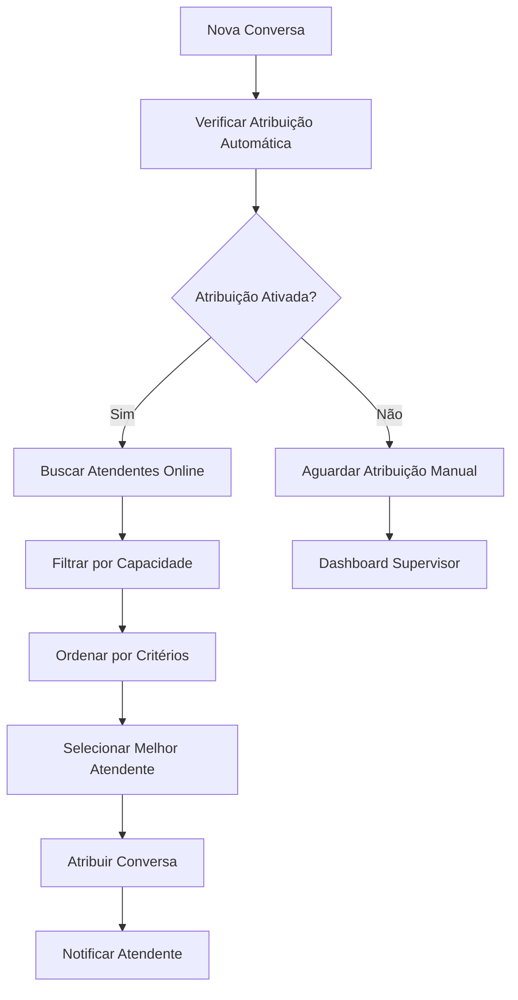
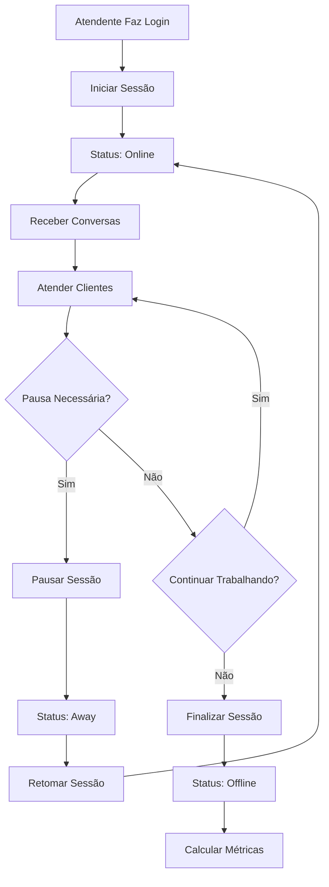

# 🎯 Sistema Completo de Gestão de Atendentes

## 📋 Visão Geral

Foi implementado um sistema completo e independente de gestão de atendentes para o Connect IA, separado do sistema de Inbox existente. O sistema oferece funcionalidades avançadas de gestão de equipe, atribuição automática de conversas, métricas em tempo real e dashboard dedicado.

---

## 🏗️ Arquitetura Implementada

### 1. **Banco de Dados** (`20241026_create_attendants_system.sql`)

#### Tabelas Principais:
- **`attendants`** - Dados dos atendentes
- **`attendant_sessions`** - Sessões de trabalho
- **`conversation_assignments`** - Atribuições de conversas
- **`attendant_availability`** - Disponibilidade e horários
- **`attendant_metrics`** - Métricas de performance
- **`attendant_templates`** - Templates de resposta
- **`attendant_notes`** - Notas e observações

#### Funcionalidades do Banco:
- ✅ RLS (Row Level Security) configurado
- ✅ Triggers para atualização automática de timestamps
- ✅ Funções auxiliares para atribuição automática
- ✅ Índices otimizados para performance
- ✅ Enums para status e tipos

### 2. **Páginas React**

#### **`/attendants`** - Gestão de Atendentes
- ✅ CRUD completo de atendentes
- ✅ Filtros por status, departamento e busca
- ✅ Formulários de criação e edição
- ✅ Visualização detalhada de cada atendente
- ✅ Gestão de habilidades e especializações
- ✅ Controle de status (online, ocupado, ausente, offline)

#### **`/attendant-dashboard`** - Dashboard em Tempo Real
- ✅ Estatísticas em tempo real
- ✅ Monitoramento de atendentes online
- ✅ Lista de conversas não atribuídas
- ✅ Atribuições ativas
- ✅ Sessões de trabalho ativas
- ✅ Atribuição manual e automática
- ✅ Métricas consolidadas

### 3. **Hooks Customizados**

#### **`useAttendants.ts`**
- ✅ Queries para todos os dados de atendentes
- ✅ Mutations para operações CRUD
- ✅ Sistema de atribuição de conversas
- ✅ Gestão de sessões
- ✅ Funções auxiliares para encontrar melhor atendente

#### **`useAttendantMetrics.ts`**
- ✅ Métricas individuais e consolidadas
- ✅ Performance por período (diário, semanal, mensal)
- ✅ Cálculos automáticos de médias

#### **`useAttendantAvailability.ts`**
- ✅ Gestão de disponibilidade
- ✅ Horários de trabalho

### 4. **Edge Functions**

#### **`auto-assign-conversation`**
- ✅ Algoritmo inteligente de atribuição
- ✅ Critérios múltiplos (tempo resposta, satisfação, skills)
- ✅ Balanceamento de carga automático
- ✅ Tratamento de casos especiais

#### **`manage-attendant-session`**
- ✅ Iniciar/finalizar sessões
- ✅ Pausar/retomar sessões
- ✅ Atualização automática de status
- ✅ Controle de estado consistente

#### **`update-attendant-metrics`**
- ✅ Atualização de métricas em tempo real
- ✅ Cálculo de médias ponderadas
- ✅ Consolidação por período
- ✅ Atualização de métricas do atendente

---

## 🚀 Funcionalidades Principais

### 1. **Gestão de Atendentes**

#### ✅ Cadastro Completo
- Informações pessoais (nome, email, telefone)
- Dados profissionais (departamento, cargo, ID funcionário)
- Configurações de trabalho (horários, limite de conversas)
- Habilidades e especializações
- Idiomas suportados

#### ✅ Controle de Status
- **Online** - Disponível para atendimento
- **Busy** - Ocupado (máximo de conversas)
- **Away** - Ausente temporariamente
- **Offline** - Desconectado
- **Break** - Pausa/intervalo
- **Training** - Em treinamento

#### ✅ Configurações Avançadas
- Máximo de conversas simultâneas
- Aceitar conversas automaticamente
- Horários de trabalho personalizados
- Notificações configuráveis

### 2. **Sistema de Atribuição**

#### ✅ Atribuição Manual
- Interface intuitiva para seleção de atendente
- Visualização de carga atual de cada atendente
- Observações personalizadas
- Histórico de atribuições

#### ✅ Atribuição Automática
- Algoritmo inteligente de seleção
- Balanceamento de carga por atendente
- Priorização por tempo de resposta
- Consideração de habilidades e especializações
- Atribuição baseada em satisfação

#### ✅ Atribuição Rápida
- Botão de atribuição rápida no dashboard
- Seleção automática do melhor atendente
- Processo em um clique

### 3. **Dashboard em Tempo Real**

#### ✅ Estatísticas Live
- Atendentes online/ocupados/ausentes
- Conversas não atribuídas
- Tempo médio de resposta
- Sessões ativas

#### ✅ Monitoramento Visual
- Cards com status em tempo real
- Atualização automática a cada 15-30 segundos
- Indicadores visuais de status
- Métricas históricas

#### ✅ Gestão de Conversas
- Lista de conversas não atribuídas
- Atribuições ativas
- Filtros por canal (WhatsApp, Instagram, etc.)
- Ações rápidas

### 4. **Sessões de Trabalho**

#### ✅ Controle de Sessões
- Iniciar sessão de trabalho
- Finalizar sessão
- Pausar/retomar sessão
- Rastreamento automático de tempo

#### ✅ Métricas de Sessão
- Conversas atendidas por sessão
- Mensagens enviadas
- Tempo médio de resposta
- Duração da sessão

### 5. **Métricas e Performance**

#### ✅ Métricas Individuais
- Total de conversas atendidas
- Taxa de resolução
- Tempo médio de resposta
- Satisfação do cliente
- Primeira resolução de contato

#### ✅ Métricas Consolidadas
- Performance da equipe
- Comparação entre atendentes
- Tendências temporais
- Relatórios por período

#### ✅ Tracking em Tempo Real
- Atualização automática de métricas
- Histórico de atividades
- Alertas de performance

---

## 🎯 Fluxos de Trabalho

### 1. **Fluxo de Atribuição Automática**

### 2. **Fluxo de Sessão de Trabalho**

---

## 📊 Métricas Disponíveis

### Por Atendente:
- ✅ Total de conversas
- ✅ Conversas resolvidas
- ✅ Conversas transferidas
- ✅ Conversas abandonadas
- ✅ Tempo médio de resposta
- ✅ Tempo médio de resolução
- ✅ Tempo total de trabalho
- ✅ Satisfação média
- ✅ Total de mensagens enviadas
- ✅ Taxa de primeira resolução

### Por Período:
- ✅ Diário
- ✅ Semanal
- ✅ Mensal
- ✅ Personalizado

### Consolidadas:
- ✅ Performance da equipe
- ✅ Top performers
- ✅ Tendências temporais
- ✅ Comparações

---

## 🔧 Configurações Avançadas

### 1. **Algoritmo de Atribuição**
- Priorização por menor carga atual
- Consideração de tempo de resposta
- Avaliação de satisfação
- Matching de habilidades
- Balanceamento automático

### 2. **Horários de Trabalho**
- Configuração por dia da semana
- Fuso horário personalizado
- Pausas programadas
- Disponibilidade sazonal

### 3. **Notificações**
- Email para atribuições
- Push notifications
- Alertas sonoros
- Configuração granular

---

## 🚀 Como Usar

### 1. **Primeiro Acesso**
1. Acesse `/attendants` para gerenciar atendentes
2. Crie o primeiro atendente da equipe
3. Configure habilidades e especializações
4. Defina horários de trabalho

### 2. **Dashboard em Tempo Real**
1. Acesse `/attendant-dashboard`
2. Ative atribuição automática se desejar
3. Monitore conversas não atribuídas
4. Gerencie sessões de trabalho

### 3. **Atribuição de Conversas**
1. **Manual**: Use o botão "Atribuir" na conversa
2. **Rápida**: Use "Atribuição Rápida" para seleção automática
3. **Automática**: Ative no dashboard para atribuição contínua

### 4. **Gestão de Sessões**
1. Atendente inicia sessão no dashboard
2. Sistema atualiza status automaticamente
3. Métricas são calculadas em tempo real
4. Sessão pode ser pausada/retomada

---

## 🔒 Segurança e Permissões

### ✅ Row Level Security (RLS)
- Isolamento por organização
- Apenas admins podem gerenciar atendentes
- Membros podem visualizar dados da equipe
- Proteção de dados sensíveis

### ✅ Controle de Acesso
- Baseado em roles (admin, member, viewer)
- Verificação de organização
- Validação de permissões
- Auditoria de ações

---

## 📈 Benefícios do Sistema

### ✅ Para Supervisores:
- Visão completa da equipe em tempo real
- Atribuição inteligente de conversas
- Métricas detalhadas de performance
- Controle total sobre o fluxo de trabalho

### ✅ Para Atendentes:
- Interface clara e intuitiva
- Gestão de sessões simplificada
- Feedback de performance
- Configurações personalizáveis

### ✅ Para a Organização:
- Aumento da eficiência operacional
- Melhoria na qualidade do atendimento
- Redução de tempo de resposta
- Dados para tomada de decisão

---

## 🎯 Próximos Passos

### Funcionalidades Futuras:
- [ ] Chat interno entre atendentes
- [ ] Sistema de escalação automática
- [ ] Relatórios avançados com gráficos
- [ ] Integração com sistemas de CRM
- [ ] API para integrações externas
- [ ] App mobile para atendentes
- [ ] IA para sugestões de respostas
- [ ] Análise de sentimento em tempo real

---

## 📞 Suporte

Para dúvidas ou problemas com o sistema de atendentes:

1. **Documentação**: Consulte este arquivo
2. **Logs**: Verifique os logs das Edge Functions
3. **Banco**: Monitore as tabelas de atendentes
4. **Performance**: Use os índices criados

---

**Sistema implementado com sucesso! 🎉**

O sistema de gestão de atendentes está completamente funcional e pronto para uso em produção, oferecendo uma solução robusta e escalável para gerenciamento de equipes de atendimento.

